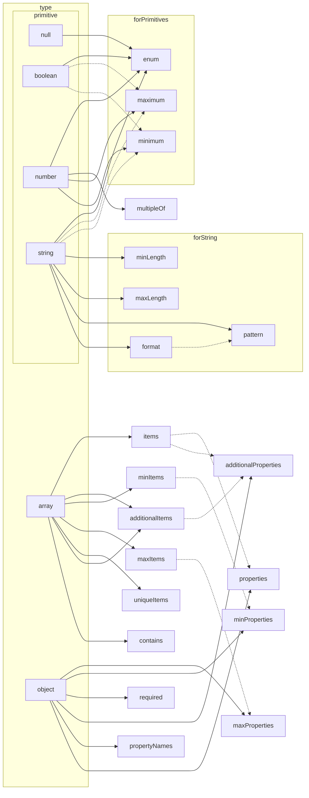

# Schemes overview

## Differences

- 04 -> 06 https://json-schema.org/draft-06/json-schema-release-notes.html

- 06 -> 07 https://json-schema.org/draft-07/json-schema-release-notes.html

``` mermaid
graph LR
04.id ==rename==> 06.$id
06.$id -.- 07.$id

04.$ref ==? describe<br/>instance<br/>properties ?==> 06.$ref
06.$ref -.- 07.$ref

04.type=integer ==*.0 is integer==> 06.type=integer
06.type=integer -.- 07.type=integer

04.exclusive ==change type==> 06.exclusive
06.exclusive -.- 07.exclusive

04.$schema=true ==#sugar==> 06.$schema=true
04.$schema=false ==#sugar==> 06.$schema=false
06.$schema=true -.- 07.$schema
06.$schema=false -.- 07.$schema

06.propertyNames -.- 07.propertyNames
06.contains -.- 07.contains
06.examples -.- 07.examples

04.enum=x ==#sugar==> 06.const
06.const -.- 07.const

04.required=? == <b>? ? ?</b> ==> 06.required=empty
06.required=empty -.- 07.required

04.dependencies=? == <b>? ? ?</b> ==> 06.dependencies=empty
06.dependencies=empty -.- 07.dependencies

04.default_ -.- 06.default_
06.default_ -.- 07.default_
04.default_ == <b>? ? ?</b> ==> 06.examples

04.enum -.- 06.enum
06.enum -.- 07.enum
04.enum == <b>? ? ?</b> ==> 06.contains

subgraph draft04
subgraph $schema
04.$schema=true["$schema: {}"]
04.$schema=false["$schema: {not: {}}"]
end

04.id[id]
04.$ref["$ref(?)"]
04.type=integer[type: integer]
04.exclusive[exclusive<br/>Min and Max<br/>:boolean]
subgraph enum
04.enum[enum]
04.enum=x["enum: [x]"]
end
subgraph required
04.required=?["required: ?"]
end
subgraph dependencies
04.dependencies=?["dependencies: ?"]
end
04.default_[default]
end

subgraph draft06
subgraph $schema
06.$schema=true[$schema: true]
06.$schema=false[$schema: false]
end
subgraph NEW
06.propertyNames[propertyNames]
06.contains[contains]
end
06.$id[$id]
06.examples[examples]
06.$ref["$ref(?)"]
06.type=integer[type: integer]
06.exclusive[exclusive<br/>Min and Max<br/>:number]
06.const[const]
subgraph required
06.required=empty["required: []"]
end
subgraph dependencies
06.dependencies=empty["dependencies: []"]
end
06.default_[default]
06.enum[enum]
end

subgraph draft07
07.$schema[$schema]
07.enum[enum]
07.propertyNames[propertyNames]
07.contains[contains]
07.examples[examples]
07.const[const]
07.$id[$id]
subgraph ???
07.$comment[$comment]
07.if[if-then-else]
07.readOnly[readOnly]
07.writeOnly[writeOnly]
07.contentMediaType[contentMediaType]
07.contentEncoding[contentEncoding]
end
07.required[required]
07.dependencies[dependencies]
07.$ref[$ref]
07.type=integer[type: integer]
07.exclusive[exclusive<br/>Min and Max<br/>:number]
07.default_[default]
end
```

## Type constraints



